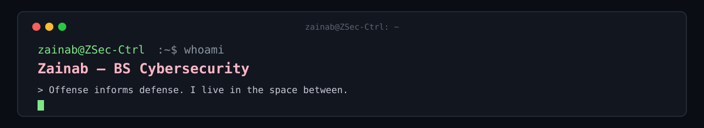
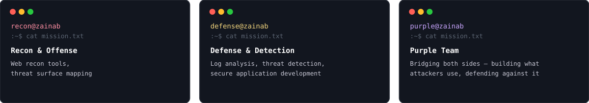

<!-- Visitor Counter -->
<p align="left">
  
</p>

---

### 🎓 About Me

```
$ cat about.txt
> BS Cybersecurity student @ Air University Islamabad
> Passionate about Cyber Threat Intelligence & Secure Development
> Offense informs defense. I live in the space between
```

---

### 🎯 What I Build
<p align="center">
  
</p>

---

### 🛡️ Skills & Tools
<p align="left">
  
  
  
  
  
</p>

---

### 📊 GitHub Stats
<p align="center">
  
  
</p>
<p align="center">
  
</p>

---

### 🐍 Contribution Graph
<p align="center">
  
</p>

---


